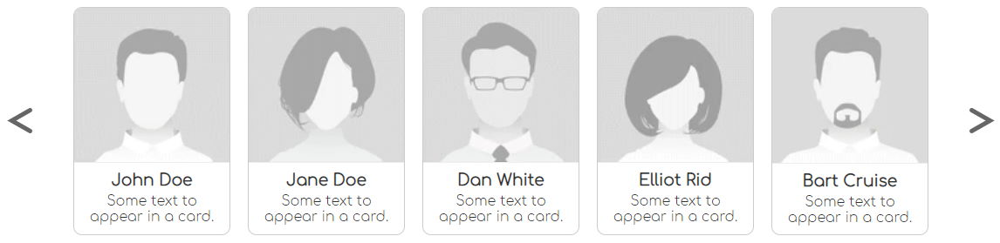

# W-Slider
To make a slider you need to attach `w-slider.js` and pass `id="w-slider"`

```html
<div id="w-slider" multiple>
    <article>Your card of specific size.</article>
</div>
```

Pass `multiple` attribute to slide the whole screen of cards. Otherwise it will slide each card.
The `style` element is inserted before the first `link` tag, so you can restyle buttons.
Here are the class names:
* `.w-slider__button-leaf` - Basic right/left button style.
* `.w-slider__button-left` - Left button.
* `.w-slider__button-right` - Right button.



## Planned to do
* Add sliding with mouse.
* Add attribute `infinite` that makes sliding infinite.
* Animate end-of-slider when not `infinite`.
